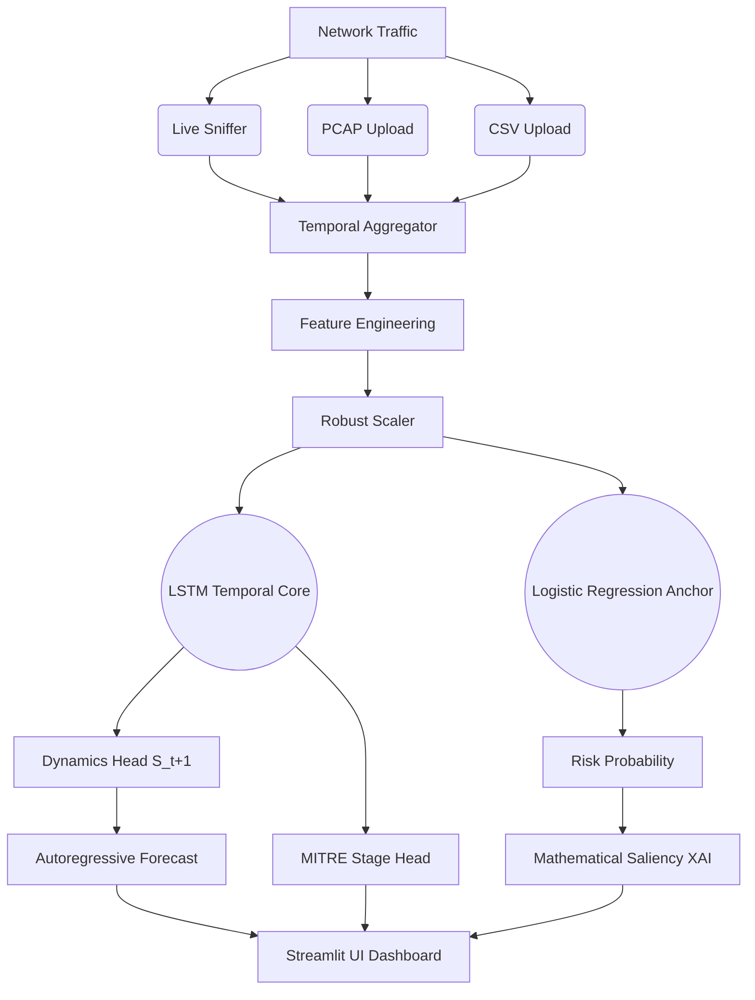

# Architecture Document - AI Network Attack Forecasting (Pipeline 2.0)

## Overview
This system uses a **Spatial-Temporal World Model (ST-WM) Ensemble** implementation tailored for cybersecurity. It is designed to learn the normal progression of network traffic, identify protocol anomalies immune to bandwidth spoofing, and map them to the MITRE ATT&CK kill chain.

## Pipeline 2.0 Architecture

### 1. Data Ingestion & Preprocessing
The data ingestion layer is capable of handling both offline historical datasets (for training) and real-time live network captures (for inference).
- **CSV Loader (`src2/data/csv_loader.py`)**: Ingests standard flow logs (e.g., CIC-IDS-2018 format), standardizes column names to 20 canonical features, handles missing values, and strictly enforces temporal ordering.
- **PCAP Parser (`src2/data/pcap_parser.py`)**: A Scapy-based dual-scale feature ingestion engine that extracts deep packet-level telemetry—including TCP Window Size, URG flag counts, Payload distribution, and Scan Entropy—and aggregates them into flows using canonical 5-tuples.
- **Live Aggregator (`src2/live/live_aggregator.py`)**: A highly optimized streaming thread that continuously batches real-time packets into 5-second temporal windows, applying rolling metrics to bridge the gap between packet-level bursts and flow-level analysis.

### 2. Feature Engineering (`src2/data/feature_engineering.py`)
To prevent the model from blindly alerting on volumetric spikes (e.g., a user streaming a 4K video), the pipeline derives 5 critical secondary inductive structural features from the canonical base:
- `byte_ratio`, `pkt_ratio`: Captures asymmetric transfers indicative of C2 beacons or data exfiltration.
- `iat_jitter`: Measures irregular inter-arrival timing (flow_iat_std / flow_iat_mean).
- `syn_rate`, `rst_rate`: Normalized protocol state aberrations.

### 3. Temporal Processing (`src2/data/temporal_windows.py`)
- Groups chronological sequences into sliding tensors of shape `(N, seq_len=5, 25)`.
- Pre-scaled using robust quantiles (`RobustScaler`) and explicitly clipped to `[-10, 10]` to prevent hidden-state mathematical explosions when processing unprecedented outlier traffic.

### 4. ST-WM Ensemble Architecture
The core forecasting engine utilizes a hybrid approach, anchoring deep learning dynamics with interpretable linear models.
- **Risk Anchor (Logistic Regression):** Provides the primary probability of compromise. Weights for pure volumetric features are heavily regularized/zeroed out to guarantee a 0% False Positive Rate on high-bandwidth benign traffic.
- **Temporal Core:** A 2-layer LSTM ($H=64$, Dropout=0.3) representing the Spatio-Temporal memory.
- **Dynamics Head (The World Model):** Predicts the normalized feature vector of the *next* temporal window ($S_{t+1}$) using `SmoothL1Loss`. This explicitly learned state transition allows 12-step (60-second) autoregressive rollouts.
- **Stage Head:** Multi-class `CrossEntropyLoss` classifier tracking the progression across 6 stages of the MITRE kill-chain.

### 5. Cybersecurity Intelligence (XAI)
To provide security analysts with actionable intelligence rather than opaque alerts:
- **Mathematical Saliency (XAI):** Calculates the exact mathematical contribution (`|weight * scaled_input|`) of each feature to the Logistic Regression anchor, dynamically rendering the top risk-driving factors (e.g., in a SHAP-like visualization).
- **Temporal Attention:** Highlights which 5-second windows in the sequence contributed most to the anomaly.
- **Rule Engine:** Correlates inferred state patterns against deterministic MITRE ATT&CK techniques (e.g., T1046, T1110, T1071).

### 6. User Interface & Demonstration (`app.py`)
A polished Streamlit dashboard that provides:
- **Offline CSV / PCAP Uploaders:** Allows users to interactively drop their own traffic logs or packet captures for analysis.
- **Live Interface Sniffing:** Binds to physical NICs via Npcap/libpcap for real-time demonstration.
- **Forecasting Visualizations:** Renders the 60-second autoregressive trajectory alongside the current MITRE stage and top XAI explanations.

## Architecture Diagram (Mermaid)

## Deployment Considerations
- Must be run offline in air-gapped environments.
- Requires Npcap/WinPcap for live sniffing on Windows, or libpcap on Linux.
- Models are persisted in `eval_results/` and must be distributed alongside the codebase.
